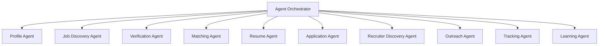
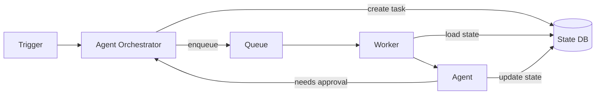
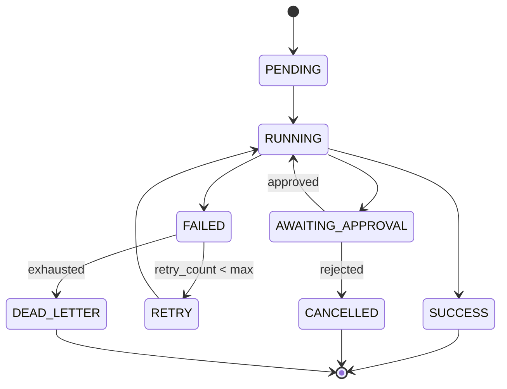
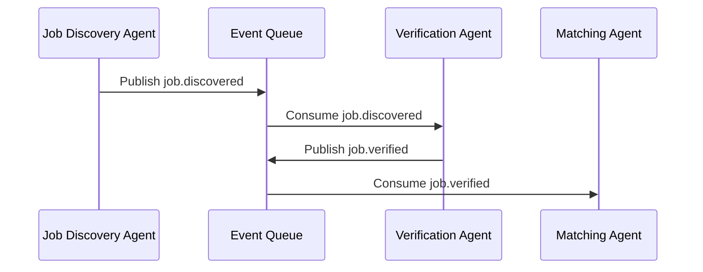

# AI Career Agent — Agent Architecture

## 1. Philosophy

The system does not assume that a multi-agent architecture is always required. It uses **specialized agents only where they provide clear value**: separation of concerns, independent failure domains, different scaling needs, or different tool access patterns. Simple CRUD operations (e.g., profile editing) are implemented as traditional services, not agents.

> **Authentication & Challenge Management** is implemented as a set of
> candidate-scoped **services/workflows** (not an agent): `auth providers, states,
> challenges, workflow runs, browser sessions, secret references`. It records
> where authentication is needed and when a site asks for human verification.
> It performs **no** automation and **never** stores or resolves secrets —
> challenges are closed only after an explicit human act. See
> [`docs/architecture/authentication-and-challenges.md`](docs/architecture/authentication-and-challenges.md).

## 2. When to Use an Agent vs. a Service

| Use an Agent | Use a Service/Workflow |
|--------------|------------------------|
| Autonomous, goal-oriented task (discover jobs, verify). | Direct CRUD with clear request/response (profile update). |
| Needs planning, memory, or multi-step reasoning. | Simple validation and persistence. |
| Requires tool use over external systems. | Internal state transitions with no external tool. |
| Benefits from retry/failure isolation. | Synchronous UI actions. |
| Produces a decision or recommendation. | Data transformation. |

## 3. Agent Catalog

### 3.1 Profile Agent

* **Responsibility:** Maintain the candidate profile and resume versions.
* **Tools:** Profile database, resume parser, document store.
* **Memory:** Long-term profile state; short-term edit context.
* **When not an agent:** Read/update profile via API service.
* **Idempotency:** Profile writes keyed by candidate id + operation id.

### 3.2 Job Discovery Agent

* **Responsibility:** Discover, extract, normalize, and deduplicate job postings.
* **Tools:** HTTP client, Playwright (when JS-rendered pages are permitted), parser modules, robots.txt checker.
* **Memory:** Last crawl timestamp per source; cursor per listing page.
* **Output:** Normalized `Job` records linked to `JobSource` and `Company`.
* **Scheduling:** Runs periodically per source.

### 3.3 Verification Agent

* **Responsibility:** Verify company legitimacy, official domain, job freshness, and suspicious content.
* **Tools:** DNS/Whois lookups, official company site validation, risk-rule engine.
* **Memory:** Verified company cache; domain reputation.
* **Output:** `JobVerification` with risk score.
* **Failure mode:** Mark UNVERIFIED and surface only after manual review.

### 3.4 Matching Agent

* **Responsibility:** Compute explainable 0–100 match scores.
* **Tools:** Rule engine, LLM abstraction, vector similarity, profile data.
* **Memory:** Cached match results keyed by (job_hash, profile_hash).
* **Output:** `JobMatch` with score, weights, and reason list.
* **Safety:** Reasons must map to explicit profile facts; hallucinations rejected.

### 3.5 Resume Agent

* **Responsibility:** Select the best resume version and generate a factually tailored resume.
* **Tools:** Resume templates, document generator, LLM abstraction.
* **Memory:** Resume version history; per-application variant records.
* **Output:** Tailored resume document + selection rationale.
* **Invariants:** Never invent employers, titles, dates, skills, or metrics.

### 3.6 Application Agent

* **Responsibility:** Prepare application answers, cover letters, and submission data.
* **Tools:** LLM abstraction, form schema detector, question classifier.
* **Memory:** Draft versions; human edits.
* **Output:** `Application` with prepared answers and documents.
* **Checkpoint:** Creates an approval request before any external action.

### 3.7 Recruiter Discovery Agent

* **Responsibility:** Discover publicly available recruiting contacts.
* **Tools:** Public page adapters, company directory search, confidence scorer.
* **Memory:** Previously discovered contacts; source evidence.
* **Output:** `RecruiterContact` with confidence score and public evidence URL.
* **Constraint:** Contacts with confidence < 70 are not surfaced.

### 3.8 Outreach Agent

* **Responsibility:** Draft personalized recruiter and networking messages.
* **Tools:** LLM abstraction, email template engine, rate limiter.
* **Memory:** Message history; send caps.
* **Output:** Draft `OutreachMessage` pending approval.
* **Constraint:** No automatic send; approval required by default.

### 3.9 Tracking Agent

* **Responsibility:** Maintain the lifecycle state machine for jobs, applications, and outreach.
* **Tools:** State-machine engine, notification service, database.
* **Memory:** Current state and transition history.
* **Output:** State transitions + audit events.

### 3.10 Learning Agent

* **Responsibility:** Analyze outcomes and recommend improvements to matching, discovery, and profile.
* **Tools:** Analytics queries, LLM summarization, feedback forms.
* **Memory:** Aggregated outcome history.
* **Output:** Recommendations (user must approve factual changes).
* **Constraint:** Never overwrite factual candidate information automatically.

## 4. Orchestration Strategy

### 4.1 Agent Orchestrator Responsibilities

* Receive scheduled or event-driven triggers.
* Instantiate agents with the correct toolset and memory.
* Dispatch tasks to the queue.
* Track task state (`PENDING`, `RUNNING`, `SUCCESS`, `FAILED`, `AWAITING_APPROVAL`).
* Resume workflows after approval.
* Enforce idempotency and retry policies.

### 4.2 Task State Machine

### 4.3 Idempotency

* Task IDs are deterministic: `<workflow>:<entity_id>:<version_or_date>:<agent>`.
* Database writes use `INSERT ... ON CONFLICT DO NOTHING/UPDATE` semantics.
* Agents check current state before executing external actions.

### 4.4 Retry Strategy

| Failure type | Retry | Backoff | Max attempts |
|--------------|-------|---------|--------------|
| Transient network | Yes | Exponential (30s base) | 5 |
| Rate limited | Yes | Source-specific + jitter | 10 |
| LLM timeout | Yes | 5s, 15s, 60s | 3 |
| Permanent (404, forbidden) | No | — | 1 |
| CAPTCHA/MFA detected | No | Human alert | 1 |

## 5. Agent-to-Agent Communication

Agents do not call each other directly. They communicate through:

1. **Shared database state** — the canonical source of truth.
2. **Events on the queue** — orchestrator emits events such as `job.verified`, `match.completed`, `approval.granted`.
3. **Approval requests** — an agent can pause and wait for a human decision.

## 6. Memory Strategy

| Memory Type | Storage | Scope | Example |
|-------------|---------|-------|---------|
| Long-term | PostgreSQL | Persistent candidate profile, jobs, applications. | Candidate skills. |
| Working | Redis | Short-term task context and caches. | LLM match cache. |
| Ephemeral | In-process | Per-run agent scratchpad. | Parsed job tokens. |
| RAG | pgvector | Semantic retrieval across job descriptions and profile. | Similar past applications. |

## 7. RAG Strategy

* Embed job descriptions, candidate profile sections, and past application summaries.
* Store embeddings in `pgvector`.
* Use similarity search sparingly to augment matching and learning; not as the primary scoring mechanism.
* Re-embed when profile or job changes significantly.

## 8. Tool Calling

* Agents receive a curated toolset injected by the orchestrator.
* Tools are stateless functions with explicit input/output schemas.
* External-facing tools (browser, email) log every invocation.
* Dangerous tools (send email, submit form) require approval tokens.

## 9. Observability

Each agent run produces:

* `AgentRun` record with start/end time, inputs, outputs, status.
* Structured logs (JSON) with trace IDs.
* Audit events for external actions and approval decisions.
* Cost metrics (LLM tokens, browser time).

## 10. Failure Handling

* Agents catch exceptions at the tool boundary.
* External action failures produce `AgentRun` failures, not silent retries.
* Approval timeouts never auto-resolve.
* Dead-letter events are reviewed via the dashboard.

## 11. Scheduling

* Celery Beat runs periodic schedules defined in `config/schedules.yaml`.
* Sources can be enabled/disabled and have custom cadences.
* Manual triggers are available via API for testing.

## 12. Human Approval Workflow

See [`ARCHITECTURE.md`](ARCHITECTURE.md) section 8. Key points:

* Default autonomy level: `PREPARE + APPROVE`.
* Approval requests include job summary, match score, draft materials, and recommended action.
* The orchestrator pauses the workflow until a decision is recorded.
