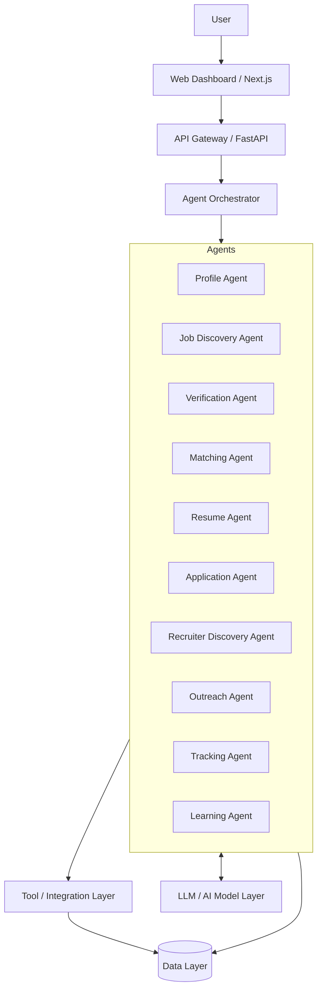
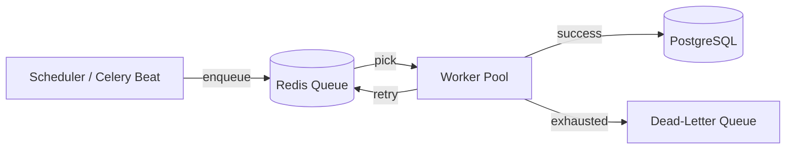
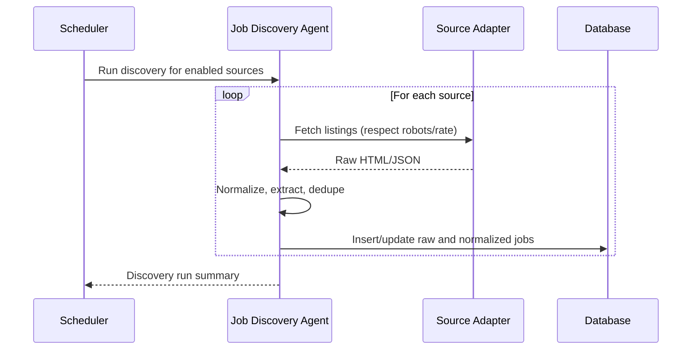
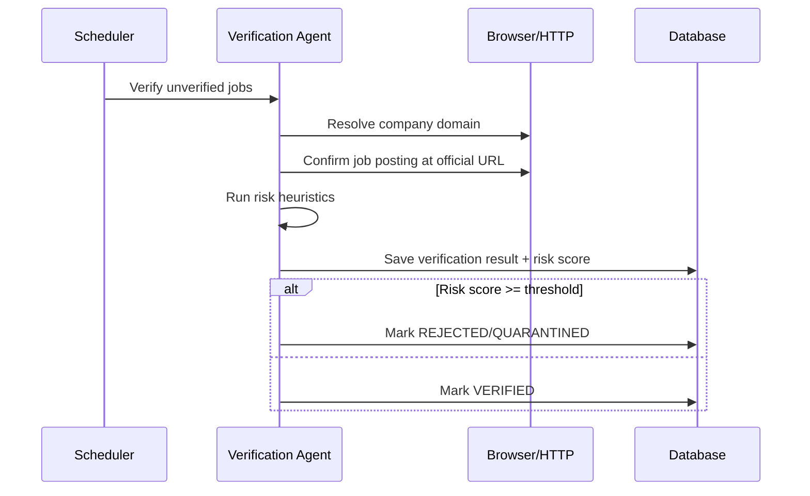
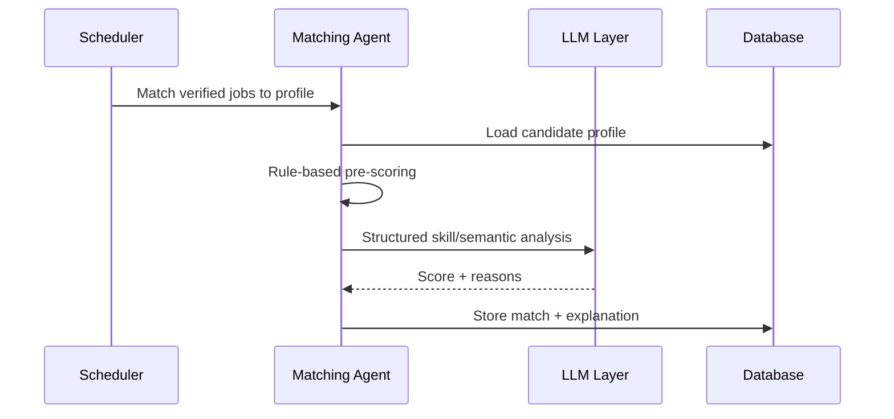
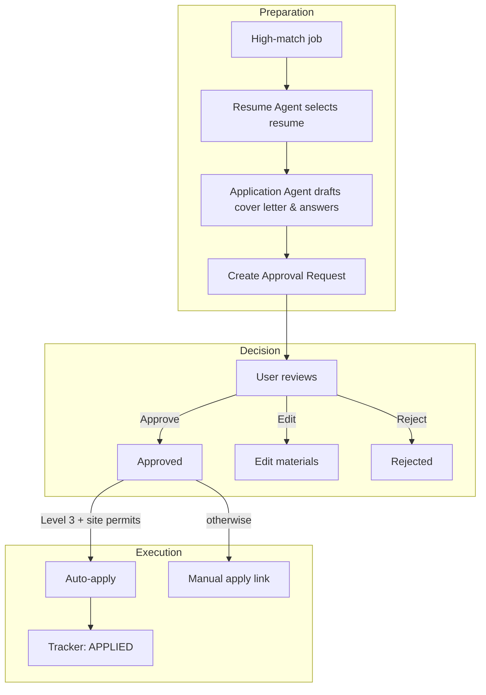
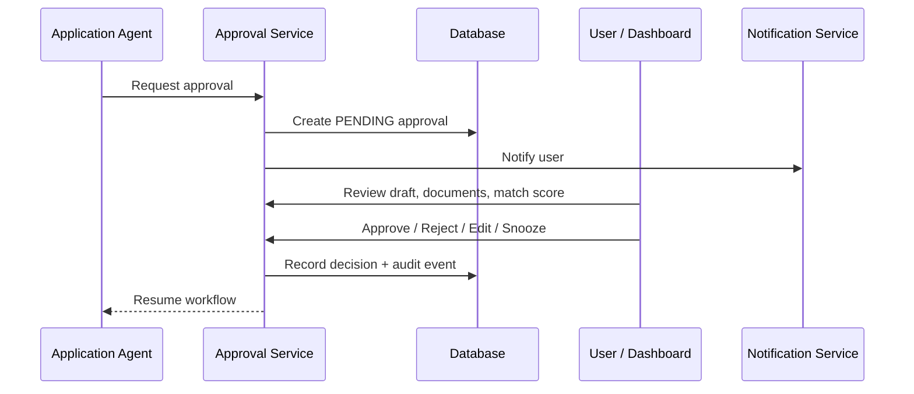
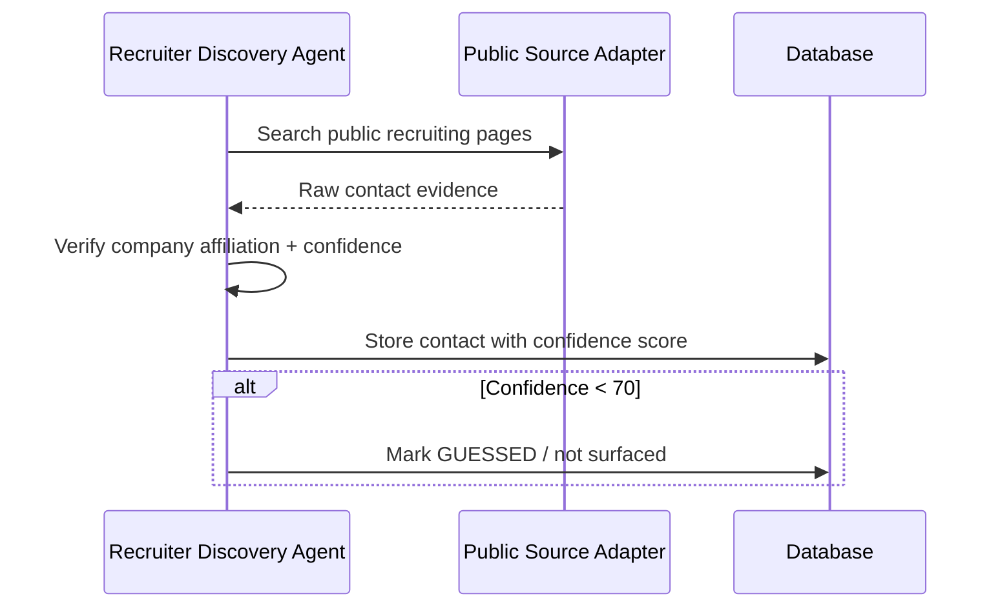
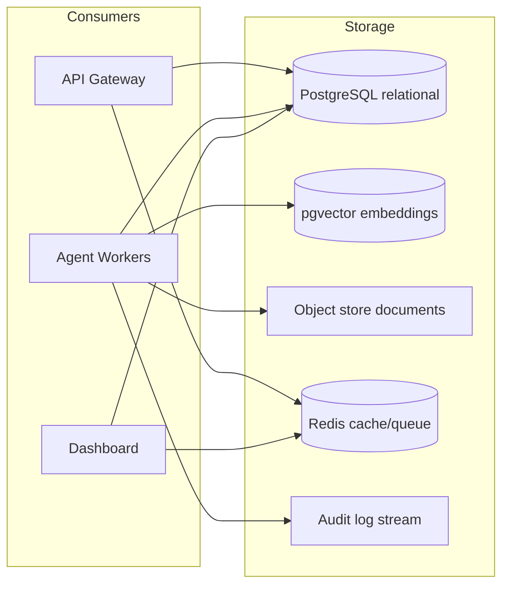
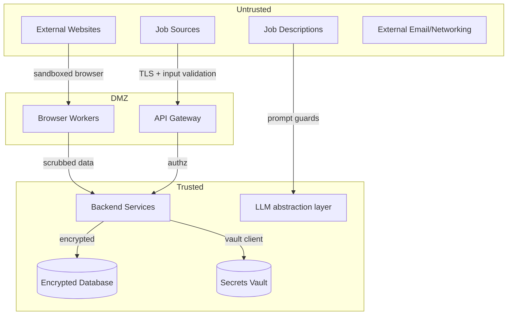

# AI Career Agent — System Architecture

## 1. Architectural Goals

* **Responsible automation:** Human-in-the-loop by default.
* **Modularity:** Each functional area can evolve independently.
* **Auditability:** Every state change and decision is logged.
* **Resilience:** Retry, idempotency, and graceful failure handling.
* **Privacy:** PII encrypted, least-privilege access, secure deletion.
* **Scalability:** Start simple; scale the queue and workers as needed.

## 2. High-Level Architecture

### Layer Responsibilities

| Layer | Responsibility |
|-------|----------------|
| User | Views dashboard, manages profile, approves actions. |
| Web Dashboard | React/Next.js UI, forms, approval screens, analytics. |
| API Gateway | Authentication, rate limiting, request routing, input validation. |
| Agent Orchestrator | Schedules tasks, dispatches agents, manages state, handles retries. |
| Specialized Agents | Perform domain-specific work (discovery, matching, preparation). |
| Authentication & Challenges | Provider-neutral auth state, human-verification challenges, human-in-the-loop workflows, secrets-references. |
| Tool/Integration Layer | Pluggable adapters for job sources, ATS, browser, email, networking. |
| Data Layer | Relational database, object storage, vector store, audit logs. |
| LLM Layer | Structured generation, summarization, matching, personalization. |

## 3. Component Descriptions

### 3.1 API Gateway

* Authenticates users via OAuth2/OIDC.
* Enforces rate limits and request validation.
* Routes requests to services or triggers agent tasks.
* Returns structured errors; never leaks stack traces or secrets.

### 3.2 Agent Orchestrator

* Stores task definitions and workflow state.
* Pushes tasks to a queue and observes worker completion.
* Handles retries with exponential backoff.
* Routes human approvals back into workflows.
* Guarantees idempotency via deterministic task IDs.

### 3.3 Authentication & Challenge Management (Foundation)

Implemented as a backend foundation (see
[`docs/architecture/authentication-and-challenges.md`](docs/architecture/authentication-and-challenges.md)).
It is provider/site-neutral: it records *where* the agent may need to
authenticate (`AuthProvider`), the current auth state (`AuthProviderState`),
and *when a site requires human verification* (`Challenge` with a linked
human-in-the-loop `WorkflowRun`). Key invariants:

* No secrets are ever stored — only opaque references (`SecretReference`,
  `session_reference`, `storage_reference`) resolved by an injected external
  secrets provider.
* No CAPTCHA/MFA/anti-bot bypass and no automatic resolution. A challenge is
  closed only after an explicit human act, at which point the paused workflow
  resumes exactly once.
* Application automation is a **future phase**, not part of this foundation.

### 3.3 Specialized Agents

| Agent | Core Purpose |
|-------|--------------|
| Profile Agent | Manage candidate profile and resume versions. |
| Job Discovery Agent | Discover and normalize jobs from configured sources. |
| Verification Agent | Verify companies/domains/jobs and score risk. |
| Matching Agent | Compute explainable job-to-profile match scores. |
| Resume Agent | Select and tailor resumes while preserving facts. |
| Application Agent | Prepare application answers and cover letters. |
| Recruiter Discovery Agent | Find publicly available recruiting contacts. |
| Outreach Agent | Draft personalized recruiter/networking messages. |
| Tracking Agent | Maintain the application lifecycle state machine. |
| Learning Agent | Analyze outcomes and recommend improvements. |

## 4. 24×7 Scheduler & Queue Architecture

* **Scheduler:** Periodic discovery, verification, and matching runs.
* **Queue:** Redis-backed task queue; task IDs are deterministic to support idempotency.
* **Workers:** Celery workers that execute agents.
* **Dead-letter queue:** Captures permanently failed tasks for review.
* **Idempotency:** Tasks use composite keys like `job_id:agent_name:run_date`.

## 5. Job Discovery Workflow

## 6. Job Verification Workflow

## 7. Job Matching Workflow

## 8. Application Workflow

## 9. Human Approval Workflow

## 10. Recruiter Discovery Workflow

## 11. Data Architecture

* **PostgreSQL:** Canonical source for profile, jobs, applications, contacts, approvals, audit events.
* **pgvector:** Embeddings for semantic job/profile matching and RAG.
* **Object store:** Resume PDFs, cover letters, supporting documents.
* **Redis:** Queue, cache, session store.
* **Audit log stream:** Append-only record of decisions and security events (initially a database table; later a dedicated log store).

## 12. Security / Trust Boundaries

See [`SECURITY.md`](SECURITY.md) for the complete security model.

## 13. Technology Stack (Initial)

| Layer | Choice | Rationale |
|-------|--------|-----------|
| Backend | Python + FastAPI | Fast, async, excellent typing, large AI ecosystem. |
| Frontend | Next.js (React) | SSR/SSG, strong ecosystem, easy Vercel/cloud deployment. |
| Database | PostgreSQL + pgvector | Mature, relational integrity, vector search in same store initially. |
| Queue / Cache | Redis + Celery | Simple, reliable, well-understood for Python. |
| Browser automation | Playwright | Reliable automation, cross-browser, strong debugging. |
| LLM abstraction | LangChain / LangGraph | Provider swap without rewriting application logic. |
| Auth | OAuth2 / OIDC | Delegated identity, no password storage. |
| Documents | S3-compatible object store | Cheap, durable, encrypted. |
| Observability | Prometheus + Grafana + structured logs | Open standards, portable between clouds. |
| Deployment | Docker + cloud container service | Reproducible, cloud-agnostic. |

See [`docs/adr/`](docs/adr/) for decision records.

## 14. Cost Control Principles

* Cache LLM analysis results keyed by job/profile hash.
* Use rule-based scoring before expensive LLM calls.
* Limit discovery frequency per source.
* Run browser automation only when necessary.
* Provide cost dashboards in Phase 10.

## 15. Failure Handling

| Failure | Response |
|---------|----------|
| Job source down | Retry twice, then quarantine source. |
| LLM timeout / error | Retry with exponential backoff; fall back to rule-based score. |
| Browser crash | Restart isolated session; report error. |
| Rate limit | Pause source, schedule retry. |
| Approval timeout | Snooze and remind user; never auto-approve. |
| Verification failure | Mark job UNVERIFIED; do not surface. |
