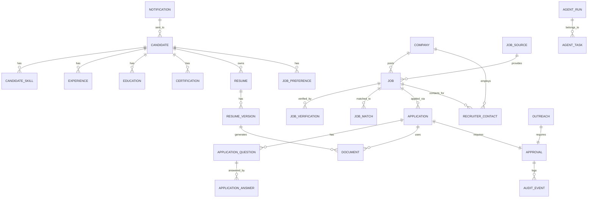
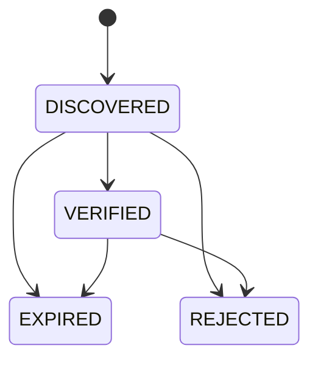
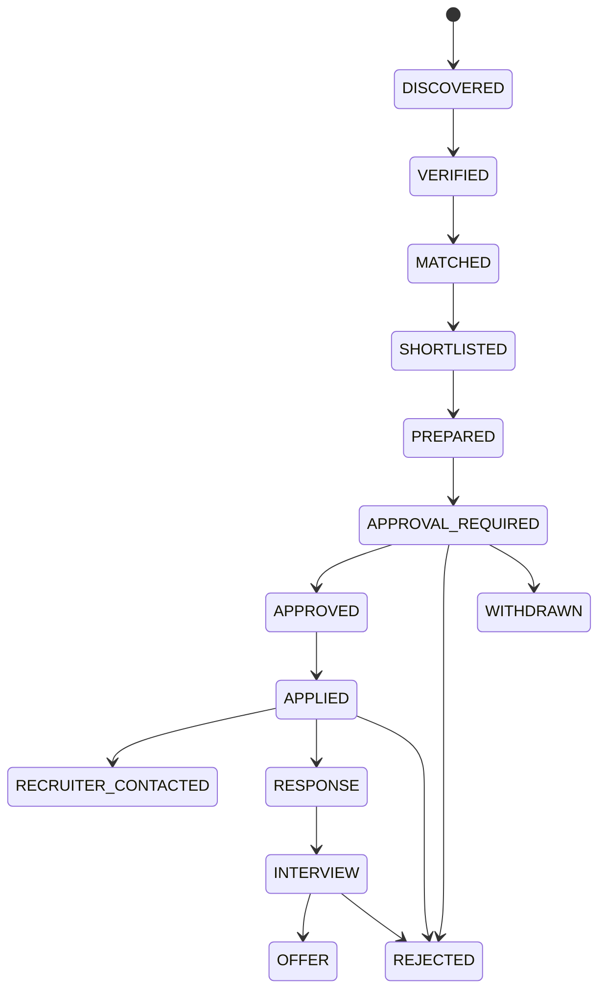

# AI Career Agent — Data Model

## 1. Design Principles

* **Single source of truth:** PostgreSQL stores canonical relational data.
* **PII protection:** Sensitive fields encrypted at the application layer.
* **Auditability:** State transitions and security events are append-only.
* **Flexibility:** JSONB used for source-specific metadata and candidate preferences.
* **Lifecycle clarity:** Every major entity has a status enum and transition rules.

## 2. Entity Relationship Overview

## 3. Core Entities

### 3.1 Candidate

| Column | Type | Notes |
|--------|------|-------|
| id | UUID | Primary key. |
| email | VARCHAR(255) | Encrypted; unique. |
| full_name | VARCHAR(255) | Encrypted. |
| phone | VARCHAR(64) | Encrypted; optional. |
| location | JSONB | City, country, work-mode preference. |
| summary | TEXT | Free-form professional summary. |
| salary_expectation | JSONB | Currency, min, max, period. |
| notice_period_days | INT | e.g., 90. |
| preferences | JSONB | Work mode, relocation, industries. |
| status | ENUM | ACTIVE, PAUSED, DELETED. |
| created_at / updated_at | TIMESTAMP | Audit. |

**Indexes:** `email` (unique, functional index on encrypted hash), `status`.

### 3.2 CandidateSkill

| Column | Type | Notes |
|--------|------|-------|
| id | UUID | PK. |
| candidate_id | UUID | FK → candidate. |
| skill_name | VARCHAR(128) | Normalized. |
| proficiency | ENUM | BEGINNER, INTERMEDIATE, ADVANCED, EXPERT. |
| years_experience | INT | Self-reported. |
| is_primary | BOOLEAN | True for core skills. |

**Indexes:** `(candidate_id, skill_name)` unique, `skill_name`.

### 3.3 Experience

| Column | Type | Notes |
|--------|------|-------|
| id | UUID | PK. |
| candidate_id | UUID | FK → candidate. |
| employer_name | VARCHAR(255) | Encrypted. |
| title | VARCHAR(255) | e.g., Senior Engineering Manager. |
| location | VARCHAR(255) | Encrypted; optional. |
| start_date | DATE | |
| end_date | DATE | NULL if current. |
| is_current | BOOLEAN | |
| description | TEXT | |
| skills_used | TEXT[] | Normalized skill tags. |

**Indexes:** `candidate_id`, `is_current`.

### 3.4 Education

| Column | Type | Notes |
|--------|------|-------|
| id | UUID | PK. |
| candidate_id | UUID | FK. |
| institution | VARCHAR(255) | Encrypted. |
| degree | VARCHAR(255) | e.g., Bachelor of Engineering. |
| field_of_study | VARCHAR(255) | |
| start_year | INT | |
| end_year | INT | |

**Indexes:** `candidate_id`.

### 3.5 Certification

| Column | Type | Notes |
|--------|------|-------|
| id | UUID | PK. |
| candidate_id | UUID | FK. |
| name | VARCHAR(255) | |
| issuer | VARCHAR(255) | |
| issue_date | DATE | |
| expiry_date | DATE | Optional. |

**Indexes:** `candidate_id`.

### 3.6 Resume / ResumeVersion

#### Resume

| Column | Type | Notes |
|--------|------|-------|
| id | UUID | PK. |
| candidate_id | UUID | FK. |
| name | VARCHAR(255) | e.g., "Technical Manager — 2026". |
| is_default | BOOLEAN | |
| source_file_url | TEXT | Object-store path. |

#### ResumeVersion

| Column | Type | Notes |
|--------|------|-------|
| id | UUID | PK. |
| resume_id | UUID | FK → resume. |
| version_number | INT | |
| content_json | JSONB | Parsed sections. |
| file_url | TEXT | Generated PDF path. |
| tailored_for_job_id | UUID | FK → job; NULL if base. |

**Indexes:** `candidate_id`, `(resume_id, version_number)` unique.

## 4. Job Entities

### 4.1 Company

| Column | Type | Notes |
|--------|------|-------|
| id | UUID | PK. |
| name | VARCHAR(255) | |
| website_domain | VARCHAR(255) | Official domain. |
| careers_url | TEXT | |
| linkedin_url | TEXT | Optional. |
| verification_status | ENUM | UNVERIFIED, VERIFIED, REJECTED. |
| metadata | JSONB | Industry, size, location. |

**Indexes:** `website_domain` unique where verified.

### 4.2 JobSource

| Column | Type | Notes |
|--------|------|-------|
| id | UUID | PK. |
| name | VARCHAR(128) | e.g., LinkedIn Jobs API, company career site. |
| source_type | ENUM | API, CAREER_SITE, JOB_BOARD, ATS. |
| base_url | TEXT | |
| terms_allow_automation | BOOLEAN | False until proven otherwise. |
| crawl_config | JSONB | Rate limits, selectors, headers. |
| is_enabled | BOOLEAN | |

### 4.3 Job

| Column | Type | Notes |
|--------|------|-------|
| id | UUID | PK. |
| company_id | UUID | FK → company. |
| job_source_id | UUID | FK → job_source. |
| external_id | VARCHAR(255) | Requisition id or source key. |
| title | VARCHAR(500) | |
| description | TEXT | Raw/structured. |
| location | JSONB | Remote/hybrid/onsite details. |
| employment_type | ENUM | FULL_TIME, CONTRACT, PART_TIME. |
| salary_range | JSONB | Optional. |
| url | TEXT | Canonical posting URL. |
| posted_date | DATE | |
| status | ENUM | DISCOVERED, VERIFIED, EXPIRED, REJECTED. |
| content_hash | VARCHAR(64) | For deduplication. |
| raw_metadata | JSONB | Original source fields. |

**Indexes:** `url` unique, `(company_id, external_id)` unique, `content_hash`, `status`, `posted_date`.

### 4.4 JobVerification

| Column | Type | Notes |
|--------|------|-------|
| id | UUID | PK. |
| job_id | UUID | FK → job. |
| company_verified | BOOLEAN | |
| domain_verified | BOOLEAN | |
| job_exists_verified | BOOLEAN | |
| risk_score | INT | 0–100. |
| risk_reasons | JSONB | |
| verified_at | TIMESTAMP | |

**Indexes:** `job_id` unique.

### 4.5 JobMatch

| Column | Type | Notes |
|--------|------|-------|
| id | UUID | PK. |
| job_id | UUID | FK → job. |
| candidate_id | UUID | FK → candidate. |
| score | INT | 0–100. |
| weights_version | VARCHAR(64) | |
| reasons | JSONB | Explainable reasons. |
| confidence | INT | Model confidence 0–100. |
| matched_at | TIMESTAMP | |

**Indexes:** `(job_id, candidate_id)` unique, `candidate_id`, `score`.

## 5. Application Entities

### 5.1 Application

| Column | Type | Notes |
|--------|------|-------|
| id | UUID | PK. |
| job_id | UUID | FK → job. |
| candidate_id | UUID | FK → candidate. |
| status | ENUM | DISCOVERED, VERIFIED, MATCHED, SHORTLISTED, PREPARED, APPROVAL_REQUIRED, APPROVED, APPLIED, RECRUITER_CONTACTED, RESPONSE, INTERVIEW, OFFER, REJECTED, WITHDRAWN. |
| match_score_at_apply | INT | Snapshot. |
| applied_at | TIMESTAMP | |
| source | ENUM | MANUAL, AUTOMATED. |

**Indexes:** `candidate_id`, `job_id`, `status`.

### 5.2 ApplicationQuestion

| Column | Type | Notes |
|--------|------|-------|
| id | UUID | PK. |
| application_id | UUID | FK → application. |
| question_text | TEXT | |
| question_type | ENUM | TEXT, YES_NO, MULTIPLE_CHOICE, FILE, CUSTOM. |
| is_required | BOOLEAN | |
| requires_human_input | BOOLEAN | |

### 5.3 ApplicationAnswer

| Column | Type | Notes |
|--------|------|-------|
| id | UUID | PK. |
| application_id | UUID | FK. |
| question_id | UUID | FK. |
| answer_text | TEXT | |
| generated_by | ENUM | HUMAN, AI. |
| edited_by_human | BOOLEAN | |

**Indexes:** `(application_id, question_id)` unique.

### 5.4 Document

| Column | Type | Notes |
|--------|------|-------|
| id | UUID | PK. |
| application_id | UUID | FK. |
| document_type | ENUM | RESUME, COVER_LETTER, OTHER. |
| storage_path | TEXT | Object-store URI. |
| generated_by | ENUM | HUMAN, AI. |

## 6. Approval & Outreach Entities

### 6.1 Approval

| Column | Type | Notes |
|--------|------|-------|
| id | UUID | PK. |
| candidate_id | UUID | FK. |
| entity_type | ENUM | APPLICATION, OUTREACH. |
| entity_id | UUID | Related application or outreach id. |
| requested_action | VARCHAR(255) | e.g., "Submit application". |
| status | ENUM | PENDING, APPROVED, REJECTED, SNOOZED, EXPIRED. |
| deadline | TIMESTAMP | Optional. |
| decided_at | TIMESTAMP | |
| decided_by | VARCHAR(255) | User id/email. |

**Indexes:** `candidate_id`, `status`, `entity_type`, `entity_id`.

### 6.2 RecruiterContact

| Column | Type | Notes |
|--------|------|-------|
| id | UUID | PK. |
| company_id | UUID | FK. |
| job_id | UUID | FK; optional. |
| full_name | VARCHAR(255) | |
| role_title | VARCHAR(255) | e.g., Technical Recruiter. |
| public_profile_url | TEXT | Evidence URL. |
| email | VARCHAR(255) | Only if publicly listed and verified. |
| confidence_score | INT | 0–100. |
| contact_type | ENUM | VERIFIED, GUESSED. |

**Indexes:** `company_id`, `job_id`, `confidence_score`.

### 6.3 Outreach

| Column | Type | Notes |
|--------|------|-------|
| id | UUID | PK. |
| candidate_id | UUID | FK. |
| recruiter_contact_id | UUID | FK. |
| channel | ENUM | EMAIL, NETWORKING_MESSAGE. |
| subject | TEXT | |
| body | TEXT | |
| status | ENUM | DRAFT, APPROVAL_REQUIRED, APPROVED, SENT, FAILED. |
| sent_at | TIMESTAMP | |

### 6.4 Notification

| Column | Type | Notes |
|--------|------|-------|
| id | UUID | PK. |
| candidate_id | UUID | FK. |
| notification_type | ENUM | NEW_JOB_MATCH, APPROVAL_REQUIRED, APPLICATION_SUBMITTED, RECRUITER_RESPONSE, INTERVIEW, ERROR, SECURITY. |
| title | VARCHAR(255) | |
| body | TEXT | |
| is_read | BOOLEAN | |

**Indexes:** `candidate_id`, `is_read`, `notification_type`.

## 7. Operational Entities

### 7.1 AgentTask

| Column | Type | Notes |
|--------|------|-------|
| id | UUID | PK. |
| task_type | VARCHAR(128) | e.g., DISCOVER, VERIFY, MATCH, PREPARE. |
| entity_type | VARCHAR(128) | e.g., JOB, APPLICATION. |
| entity_id | UUID | |
| status | ENUM | PENDING, RUNNING, SUCCESS, FAILED, AWAITING_APPROVAL. |
| retry_count | INT | |
| scheduled_at | TIMESTAMP | |
| started_at | TIMESTAMP | |
| finished_at | TIMESTAMP | |

**Indexes:** `status`, `scheduled_at`, `entity_type`, `entity_id`.

### 7.2 AgentRun

| Column | Type | Notes |
|--------|------|-------|
| id | UUID | PK. |
| agent_task_id | UUID | FK → agent_task. |
| agent_name | VARCHAR(128) | |
| input_snapshot | JSONB | |
| output_snapshot | JSONB | |
| status | ENUM | SUCCESS, FAILED. |
| cost_usd | DECIMAL | Optional. |
| tokens_used | INT | |
| started_at / finished_at | TIMESTAMP | |

**Indexes:** `agent_task_id`, `agent_name`, `status`.

### 7.3 AuditEvent

| Column | Type | Notes |
|--------|------|-------|
| id | BIGSERIAL | PK. |
| event_type | VARCHAR(128) | e.g., PROFILE_UPDATED, APPROVAL_DECIDED, JOB_APPLIED. |
| actor | VARCHAR(255) | User or agent. |
| entity_type | VARCHAR(128) | |
| entity_id | UUID | |
| metadata | JSONB | |
| recorded_at | TIMESTAMP | Default now(). |

**Indexes:** `event_type`, `entity_type`, `entity_id`, `recorded_at`.

## 8. Lifecycle State Transitions

### Job Lifecycle

### Application Lifecycle

## 9. Indexes Summary

* All foreign keys indexed.
* Status columns indexed for dashboard filtering.
* Unique constraints on natural keys (email hash, URLs, job external ids).
* GIN indexes on JSONB metadata columns used in filtering.
* Partial indexes for active/pending records to speed dashboard loads.

## 10. Data Retention

* Audit logs: retained for 7 years or as required by law.
* Raw job extractions: retained 30 days after job is closed/rejected.
* Generated documents: retained until user deletes or per policy.
* Deleted candidate data: soft-delete + secure erase after retention period.
