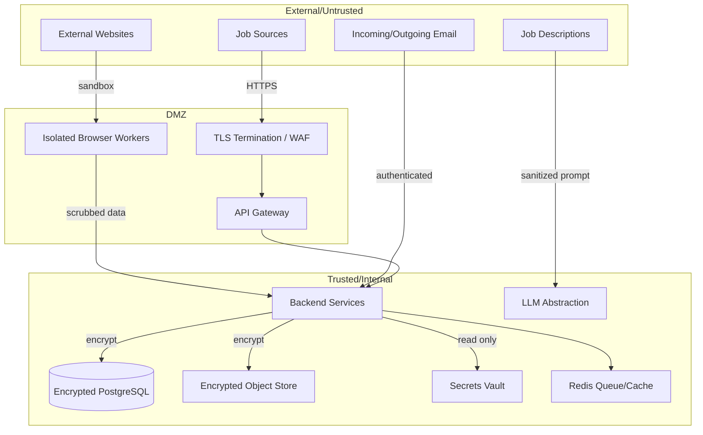

# AI Career Agent — Security Architecture

## 1. Security Goals

* Protect candidate PII, resumes, and credentials.
* Prevent unauthorized job applications or outreach.
* Treat all external content as untrusted.
* Maintain a tamper-resistant audit trail.
* Comply with website terms and applicable laws.

## 2. Trust Boundaries

## 3. Secrets Management

* Secrets (API keys, OAuth client secrets, database credentials, email credentials, LLM keys) are stored in a secrets vault (e.g., HashiCorp Vault, AWS Secrets Manager, or Doppler).
* Secrets are never committed to source control.
* Local development uses `.env.example` files only; real `.env` files are gitignored.
* Keys are rotated on a schedule and after any suspected exposure.
* Application reads secrets at startup; no plaintext passwords in logs.

### 3.1 Authentication & Challenge Foundation — References Only

The Authentication & Challenge Management foundation
(`auth_providers`, `auth_provider_states`, `challenges`, `workflow_runs`,
`browser_sessions`, `secret_references`) stores **no secret values**:

* `SecretReference.external_reference`, `AuthProviderState.session_reference`,
  and `BrowserSession.storage_reference` are opaque identifiers resolved by an
  injected `SecretsProvider` (vault). The local dev provider always reports
  "not available", so nothing sensitive can leak from a development database.
* No API route or schema accepts, returns, or logs passwords, OTPs, cookies,
  tokens, or session payloads.
* Challenge resolution is a human act; the system never attempts CAPTCHA/MFA
  bypass or automatic resolution and resumes a paused workflow only after the
  completion is recorded.

## 4. Authentication & Session Management

* Users authenticate via OAuth2 / OpenID Connect (e.g., Auth0, Google, GitHub).
* No local password storage.
* Sessions stored in Redis with TTL.
* Access tokens are short-lived; refresh tokens are rotated.
* All endpoints require a valid token except public health checks.

## 5. Encryption

### In Transit

* TLS 1.2+ everywhere: user → gateway, gateway → services, service → database.
* Mutual TLS considered for internal service communication at later phases.

### At Rest

* Database volumes encrypted by the cloud provider.
* Application-layer encryption for highly sensitive fields: email, phone, employer names, resume text.
* Object-store documents encrypted with server-side encryption + envelope encryption where supported.

## 6. PII Protection

* PII is collected only with user consent and stored minimally.
* Column-level encryption for direct identifiers.
* Access control ensures users can read/write only their own profile.
* Data export and deletion endpoints provided in Phase 13.
* Logs and exception reports are scrubbed of PII.

## 7. Resume & Document Protection

* Resumes stored only in encrypted object storage.
* Generated tailored resumes are clearly watermarked/versioned.
* Document URLs are signed and time-limited.
* Access logged in the audit trail.

## 8. Access Control

| Role | Permissions |
|------|-------------|
| Candidate (owner) | Full access to own data; approve/reject actions. |
| System / Agent | Service-level read/write per configured scope; no authentication secrets. |
| Admin (future) | Read-only operational dashboards; no access to PII without approval. |

* Authorization enforced at API gateway and service layer (defense in depth).
* OAuth scopes: `profile:read`, `profile:write`, `jobs:read`, `applications:write`, etc.

## 9. Audit Logging

Every security-relevant event is recorded:

* Profile create/update/delete.
* Login/logout/session refresh.
* Approval decisions.
* Job application submission.
* Outreach send.
* External credential read.
* Security alerts (CAPTCHA, rate-limit, suspicious job).

Audit records are append-only and include: timestamp, actor, IP, user agent, entity type/id, action, outcome, and diff.

## 10. Prompt Injection Protection

* Job descriptions and external content are passed to the LLM with strict delimiters.
* System instructions are separated from user/external content.
* Output is parsed through Pydantic schemas; unexpected keys rejected.
* LLM is instructed to ignore instructions embedded in job descriptions.
* High-confidence hallucination checks compare generated reasons against profile facts.

## 11. Malicious Job-Description Protection

* External HTML is parsed, not executed.
* Suspicious content triggers verification risk scoring.
* No external links are followed automatically during extraction.
* All URLs validated against an allow-list or source registry.
* Links in generated materials are validated before being shown to the user.

## 12. Browser Isolation

* Browser automation runs in isolated containers (Docker or cloud sandbox).
* Each session gets a clean profile; cookies/caches discarded after run.
* Network egress restricted to known domains.
* Downloads disabled or heavily restricted.
* CAPTCHA/MFA detection immediately stops the session and alerts the user.

## 13. Rate Limiting

* API rate limits per user/IP.
* Source-specific crawl rates to avoid overloading job sites.
* LLM call budgets per run and per day.
* Email/outreach daily send caps.
* Rate-limit responses trigger queue back-off.

## 14. Data Retention & Secure Deletion

* Candidate data retained only as long as the account is active or as legally required.
* Soft-delete + delayed hard-delete available.
* Deleted documents are removed from object storage and encryption keys purged where applicable.
* Audit logs retained longer but anonymized after the account deletion window.

## 15. External Website Trust Boundaries

* The backend never trusts data from external sites.
* Input validation occurs at API boundaries and before database writes.
* Job descriptions are sanitized before embedding/storage.
* Source adapters run with least privilege.
* Unknown domains are rejected unless explicitly allow-listed.

## 16. Dependency & Supply Chain

* Pin dependencies with hashes (`requirements.txt` + lock).
* Use `pip-audit` / `safety` in CI.
* Container images scanned for vulnerabilities.
* base images updated regularly.

## 17. Security Checklist by Phase

| Phase | Security Deliverable |
|-------|----------------------|
| 0 | Threat model documented, no secrets committed. |
| 1 | PII encryption, owner-based access control, audit log seed. |
| 2 | Source allow-list, robots.txt compliance, rate limits. |
| 3 | Browser isolation, malicious-content detection. |
| 4 | Prompt injection guards, fact-checking on match reasons. |
| 5 | Document encryption, output validation. |
| 6 | Approval authorization, tamper-proof audit. |
| 7 | Credential vault integration, sandboxed browser workers. |
| 8 | Privacy-safe contact discovery, data retention rules. |
| 9 | Email credential vault, send-cap enforcement. |
| 10 | Security-event alerting. |
| 11 | TLS everywhere, secret injection at runtime. |
| 12 | Bias/fairness review of learning recommendations. |
| 13 | External security review, penetration test, compliance audit. |

## 18. Incident Response

* Exposed secret: rotate immediately, revoke tokens, notify user.
* Unauthorized application caused by bug: halt all automation, audit, notify, revert state.
* Suspected breach: freeze account, preserve logs, investigate, follow applicable reporting laws.

## 19. Secure Development Practices

* No secrets in logs or error messages.
* All inputs validated with Pydantic schemas.
* SQL injection prevention via ORM + parameterized queries.
* XSS prevention via frontend output encoding.
* CSRF tokens for session-based forms (API uses bearer tokens).
* Dependency scanning in CI.
* Security review required for Level 3 automation changes.
