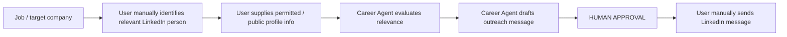

# ADR-010: LinkedIn & Gmail Integration Boundaries

## Status

Accepted

## Context

A feasibility study evaluated how the Career Agent can integrate LinkedIn. The findings
are based on a real proof-of-concept and current LinkedIn API/rule landscape:

| Gate | Capability | Result |
|------|-----------|--------|
| 1 | Gmail as a read-only bridge to LinkedIn Job Alert emails | **PASS** |
| 2 | LinkedIn people / relationship automation for this application | **FAIL** |
| 3 | Direct LinkedIn application automation as an approved dependency | **EXCLUDED** |

### Gate 1 — PASS (proven)

The standalone POC at `C:\Vijay_GitHub\linkedin-gmail-poc` demonstrated:

* Gmail OAuth 2.0 with the read-only `gmail.readonly` scope; no email modification.
* Real runs processed 20 alert messages → 110 job listings → 52 distinct canonical URLs.
* Canonical URL normalization to `https://www.linkedin.com/jobs/view/<id>` with all
  tracking/auth parameters stripped; non-normalizable URLs are excluded.
* `credentials.json` and `token.json` are gitignored and never committed.

Known limitation: extracted metadata is sparse (roughly 20/110 listings with
title + company and 0/110 with location). Alert email content is heuristic,
layout-dependent, and **untrusted input**. Gmail job-alert ingestion is therefore an
ingestion bridge only — it is not an authoritative LinkedIn job-data API.

### Gate 2 — FAIL (for this application)

* The LinkedIn Connections API is restricted, approval-based, and first-degree only.
* There is no generally available LinkedIn API for people search, employee directory,
  alumni discovery, second-degree browsing, general messaging automation, or automated
  connection requests.
* Sales Navigator and the SNAP (Sales Navigator API Platform) are partner-dependent and
  must not be assumed available.
* The originally envisioned workflow — Job → Company → LinkedIn people search →
  leadership → alumni/mutual → personalized message — cannot be automated against
  LinkedIn by this application.

### Gate 3 — EXCLUDED

Direct LinkedIn application submission is technically possible through browser automation,
but it is **not an approved capability**: it carries Terms-of-Service and account
enforcement risk and must never become a dependency of the product. Approved flow:
AI preparation → **human approval** → the user performs the final LinkedIn Apply/Submit.

## Decision

1. **Keep the provider-neutral design.** LinkedIn is not modeled as a general API
   provider in this system.
2. **Gmail LinkedIn Job Alerts are an ingestion/source provider.** Alert emails arrive
   via read-only Gmail OAuth and feed the existing `JobSource` abstraction as a
   feed-style source (an `EMAIL_ALERT` source-type extension point). No browser
   automation, no LinkedIn credentials or cookies, no CAPTCHA/anti-bot bypass.
   Sparse/unknown metadata is left sparse; the Verification and Matching agents remain
   authoritative.
3. **LinkedIn people/relationship automation stays out of scope.** No
   `LinkedInPeopleSearchService`, `AlumniMatcher`, `LinkedInMessagingService`, or
   automated connection requests. Networking uses a **user-mediated** workflow: the
   user manually identifies a relevant person on LinkedIn and supplies permitted/public
   profile information; the Career Agent evaluates relevance and drafts outreach; a human
   approves; the **user manually sends** the LinkedIn message. Networking capability
   limitations are made explicit in the abstraction.
4. **LinkedIn final application submission is human-executed.** The Career Agent
   prepares the package (resume, cover letter, answers) and creates the approval
   request; the user opens the LinkedIn job and performs the final Apply/Submit;
   application tracking continues in-app. External submission remains approval-gated.
5. **Official LinkedIn API/partner access (e.g., Jobs API, Sales Navigator/SNAP)** is
   possible only after a new feasibility gate; it is never assumed today.
6. **The `linkedin-gmail-poc` repository stays an independent feasibility project.**
   It is not coupled into `ai-career-agent` unless the architecture later requires it.

## Updated Career Agent Workflows

### Job-alert ingestion → application

```mermaid
flowchart LR
    A[LinkedIn Job Alert email in Gmail] --> B[Gmail read-only OAuth bridge]
    B --> C[Extraction + canonical URL normalization]
    C --> D[Job record + verification]
    D --> E[Match scoring]
    E --> F[Resume tailoring + application answers]
    F --> G[Package ready + approval request]
    G --> H[HUMAN APPROVAL]
    H --> I[User opens LinkedIn job]
    I --> J[User manually performs final Apply / Submit]
    J --> K[Application tracking]
```

### Networking (user-mediated)

## Security & ToS Implications

* Email/alert content is untrusted external data: instructions in email are never
  executed, no JavaScript is run, and no arbitrary URLs from email are fetched.
* OAuth tokens and client secrets are handled by the existing secrets mechanism and
  never committed or logged.
* No CAPTCHA/MFA/rate-limit bypass and no LinkedIn browser automation. `ADR-004`
  (Playwright) remains for sanctioned browser use on permitted sites, not LinkedIn.
* No candidate-fact fabrication; no private contact information is inferred or invented;
  networking contacts are user-supplied with public evidence.
* Autonomy levels and approval gates are unchanged (Level 2 — Prepare + Approve — by
  default); final LinkedIn actions are always human-executed.

## Alternatives Considered

* **LinkedIn People / Connections / Jobs APIs:** Connections API is first-degree,
  approval-restricted; no general people-search surface is available. Rejected for
  people/relationship automation (Gate 2).
* **Browser automation for LinkedIn applying/messaging (Playwright/Selenium):**
  technically possible but ToS/account-enforcement risk; excluded as a dependency
  (Gate 3).
* **LinkedIn scraping:** excluded — anti-bot bypass is prohibited by project policy.
* **Treating Gmail-alert metadata as complete job data:** rejected; metadata is sparse
  and must not be presented as authoritative.

## Consequences

* **Positive:** A ToS-respecting, read-only ingestion path is proven and can be added
  later behind the existing `JobSource` abstraction without new dependencies; the
  design remains provider-neutral.
* **Constraints:** No automated LinkedIn networking or applying; user-mediated
  identify/send steps remain; Gmail-alert metadata is sparse, so matching depends on
  verification enrichment; LinkedIn email layout changes may require parser
  maintenance.
* **Future (requires a new gate):** official LinkedIn Jobs API / partnership /
  Sales Navigator (SNAP) access and any official-path automation.