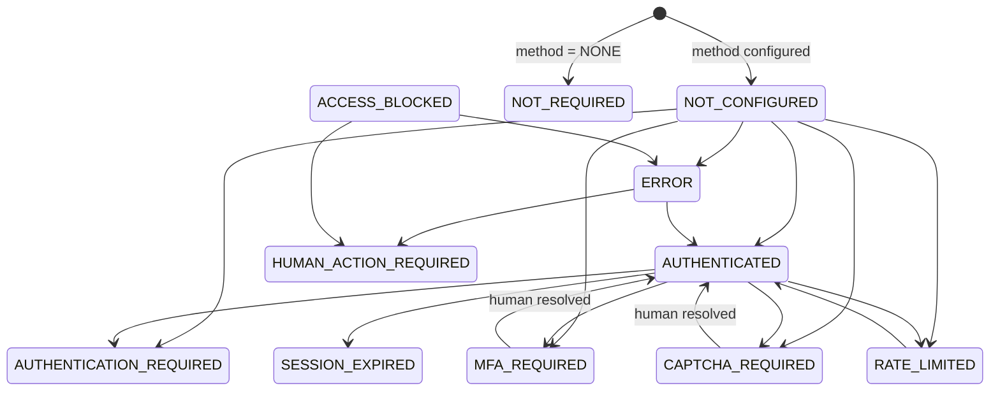
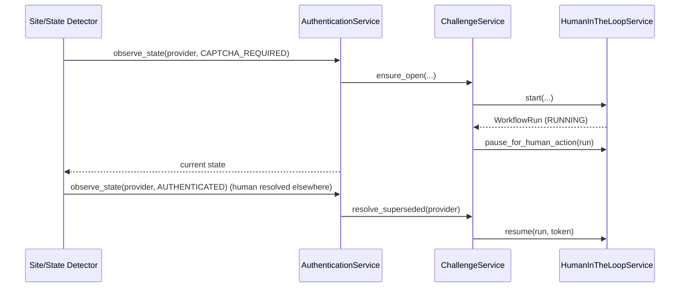

# Authentication & Challenge Management — Foundation

> **Status:** Backend foundation implemented. Application automation is a future phase.

## 1. Purpose

Record, at a provider/site-neutral level, **where** the agent may need to
authenticate, **what** the current authentication state is, and **when an
external site asks for human verification** (CAPTCHA, MFA/OTP, login, bot
protection, rate limits).

This module deliberately does **not** perform any automation, does **not** store
secrets, and does **not** resolve challenges by itself. Resolving a challenge is
always a human act performed through the site's own flow or a real browser; the
system only records the outcome and coordinates the paused workflow.

## 2. Hard Rules

* **Never store secrets.** No passwords, OTPs, cookies, tokens, or session
  payloads in the database, logs, tests, APIs, or git.
* **Never bypass** CAPTCHA, MFA, rate limits, or anti-bot measures.
* **Never auto-resolve.** Challenge completion requires an explicit human
  action; the system resumes the paused workflow only after it is recorded.
* **Human-in-the-loop by default.** Any challenge state pauses the linked
  workflow and opens an audit trail.

## 3. Entities

| Entity | Table | Purpose |
|--------|-------|---------|
| `AuthProvider` | `auth_providers` | A site the candidate may authenticate to (ATS, career site, job board, ...). |
| `AuthProviderState` | `auth_provider_states` | 1:1 current auth state per provider (with `session_reference` — an opaque pointer, never a value). |
| `Challenge` | `challenges` | Durable record of a human-verification request (type, severity, status, resolution). |
| `WorkflowRun` | `workflow_runs` | Human-in-the-loop workflow lifecycle (paused/resumed/completed with resume token). |
| `BrowserSession` | `browser_sessions` | Abstraction over browser sessions; stores only opaque `storage_reference`. |
| `SecretReference` | `secret_references` | Pointer to a secret held in an external secrets store; the value itself is never stored. |

## 4. Auth State Machine

`services/authentication_state.py` is the single source of truth for allowed
`AuthState` transitions.

Escalation states (`MFA_REQUIRED`, `CAPTCHA_REQUIRED`, `ACCESS_BLOCKED`,
`HUMAN_ACTION_REQUIRED`) may never silently disappear; they are left only via an
explicit, recorded human resolution (`AUTHENTICATED`), a declared session
problem, an error, or another authorized path.

## 5. Challenge Workflow

* `ensure_open` is idempotent: at most one in-flight challenge of a given type
  per provider (guarded by a partial unique index
  `uq_challenges_open_provider_type` on open/acknowledged/human-action states).
* Re-reporting the same state refreshes `checked_at`, logs
  `AUTH_STATE_REFRESHED`, and returns the existing challenge instead of
  creating a duplicate.
* Completing a challenge resumes the paused workflow exactly once, using its
  opaque `resume_token`, before expiry and within the capped attempt budget.

## 6. Secrets: References Only

`SecretReference` stores an identifier such as `vault://secrets/workday/password`
that an injected `SecretsProvider` understands. The local development provider
(`LocalSecretsProvider`) always resolves to "not available", making accidental
plaintext leaks impossible in dev. A production vault provider is injected
without changing the service contract.

## 7. API Surface

All routes live under `/api/v1/candidates/{candidate_id}/auth` and are
candidate-scoped (cross-user/non-existent candidates return 404):

* `GET /overview`
* `GET|POST /providers`, `GET|PUT|DELETE /providers/{id}`
* `GET|POST /providers/{id}/state` (POST is `observe_state`)
* `GET /challenges`, `GET /challenges/outstanding`, `GET /challenges/{id}`
* `POST /challenges/{id}/acknowledge|complete|cancel`
* `POST /workflows/{id}/resume`
* `GET|POST /browser-sessions`, `POST /browser-sessions/{id}/close|expire`
* `GET|POST /secrets`, `POST /secrets/{id}/rotate|revoke`, `GET /secrets/{id}/resolve`

## 8. Current Implementation Scope

Implemented in `src/backend/`:

* `models/` — `authentication.py`, `challenge.py`, `workflow_run.py`,
  `browser_session.py`, `secret_reference.py` (registered in `models/__init__.py`,
  16 tables on `SQLModel.metadata`).
* `repositories/` — candidate-scoped repositories for all five entities.
* `services/` — `authentication_state`, `challenge_detection`, `human_in_loop`,
  `authentication_provider`, `challenge`, `browser_session`, `secrets`,
  `auth_adapter` (protocol only), `authentication` (facade).
* `schemas/` — request/response models (no field can carry a secret value).
* `api/v1/authentication.py` — the router above.
* `migrations/versions/005485fe2c1f_*` — Alembic migration (verified
  upgrade/downgrade).
* `tests/` — unit tests for both state machines and challenge classification;
  API integration tests for provider CRUD, state reporting (idempotency),
  challenge lifecycle, workflow resume, and cross-user 404s.

**Not implemented (intentional):** site adapters under `auth_adapter`, a
production vault provider, and browser automation.

**Frontend:** the Next.js app (`src/frontend/`) surfaces this foundation — the
Connections page manages auth providers, sessions, secret references, and
challenges through `/api/v1/candidates/{candidate_id}/auth`. Authentication
between the browser and frontend uses an HttpOnly `access_token` cookie; the
Next.js proxy (`proxy.ts`) injects `Authorization: Bearer <token>` when
forwarding `/api/v1/*` to the backend, so the token never reaches the browser.