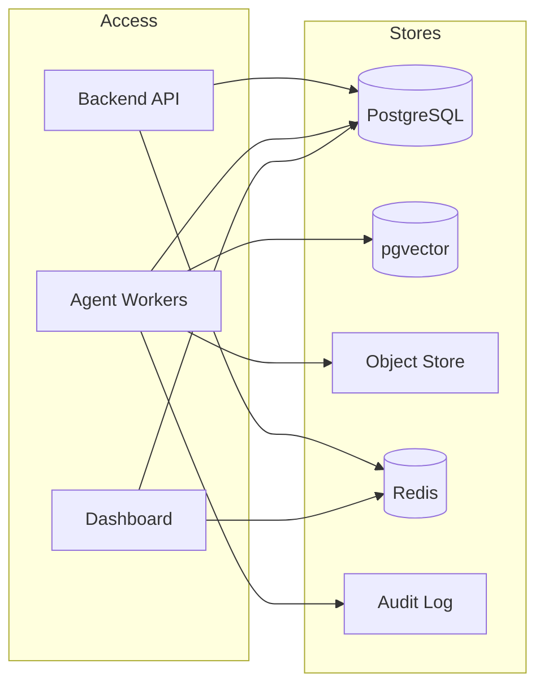

# Data Architecture

## Storage Components

## Responsibilities

| Store | Data | Access Pattern |
|-------|------|----------------|
| PostgreSQL | Profiles, jobs, matches, applications, approvals, audit events | Relational transactions, OLTP |
| pgvector | Job and profile embeddings | Similarity search, RAG |
| Object store | Resume PDFs, cover letters, supporting documents | Large binary blobs, signed URLs |
| Redis | Task queue, cache, sessions | Fast key/value, pub/sub |
| Audit log | Security events, approval decisions | Append-only |

## Access Controls

* Row-level security enforced in API/services.
* Object-store URLs signed and time-limited.
* Redis isolated to backend network; no direct external access.
* Audit log append-only; no update/delete endpoints.

## Retention

* Audit logs: 7 years or legal requirement.
* Raw extractions: 30 days after job closed.
* Generated documents: user-controlled deletion or policy-based.
* Session/cache: TTL-based.
