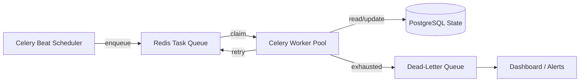

# Scheduler and Queue Architecture

The system operates continuously through a combination of scheduled triggers, event-driven tasks, queue-based execution, and retry policies.

## Components

## Trigger Types

| Trigger | Source | Example |
|---------|--------|---------|
| Scheduled | Celery Beat | Discover jobs every 6 hours. |
| Event-driven | Agent publishes event | Verify jobs after discovery. |
| User-initiated | API call | Manual discovery run. |
| Webhook (future) | ATS callback | Application status update. |

## Resilience Mechanisms

* **Idempotency:** Task IDs are deterministic. Workers check state before executing.
* **Retries:** Configured per task type with exponential backoff and jitter.
* **Dead-letter queue:** Permanently failed tasks are isolated for review.
* **Circuit breaker:** Repeated source failures disable the source temporarily.
* **Graceful restart:** Workers reload in-progress tasks from PostgreSQL on boot.

## Scheduler Cadence (Initial)

| Task | Frequency | Notes |
|------|-----------|-------|
| Job discovery | Every 6 hours | Rate-limited per source. |
| Verification | Continuous | Triggered after discovery. |
| Matching | Continuous | Triggered after verification. |
| Expired-job cleanup | Daily | Marks stale postings. |
| Learning analysis | Weekly | Analyzes outcomes. |

## Monitoring

* Worker heartbeat and task success/failure rates.
* Queue depth and age.
* Dead-letter queue growth.
* Cost per agent run.
