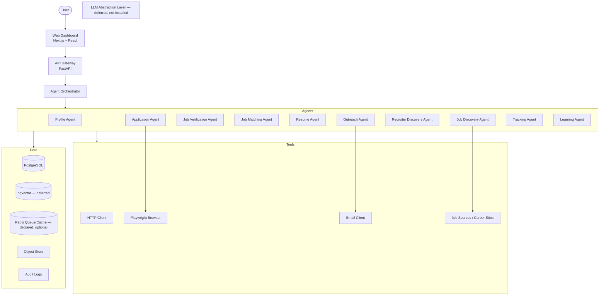

# System Architecture Diagram

## Interaction Summary

1. The user interacts with the Next.js dashboard.
2. The dashboard calls the FastAPI gateway.
3. The gateway routes to services or triggers the orchestrator.
4. The orchestrator dispatches agents to Celery workers.
5. Agents use tools (HTTP, Playwright, email) and data stores.
6. The LLM abstraction layer and pgvector vector store are **deferred**; today all
   generation, matching, and analysis is deterministic and network-free for AI content.
7. Audit logs capture every security-relevant decision.
