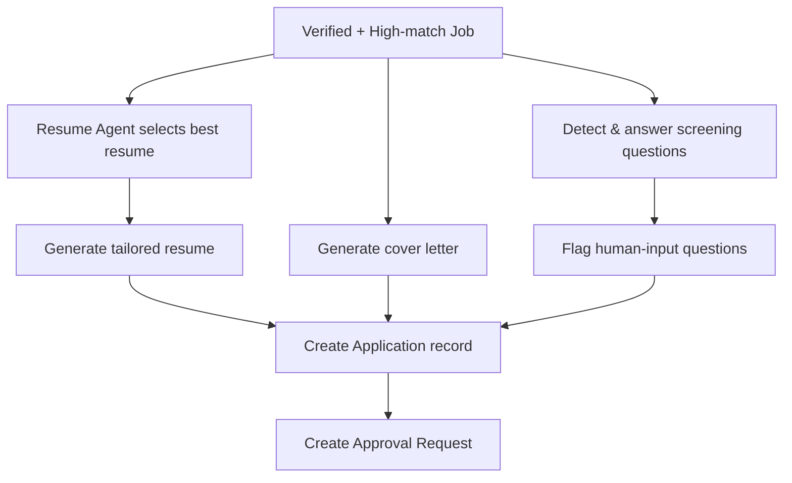

# Application Preparation Workflow

## Goal

Prepare a tailored application package (resume, cover letter, answers) for a high-match job while preserving factual accuracy.

## Flow

## Inputs

* `Job` and `JobMatch`.
* `Candidate` profile and `Resume` versions.

## Outputs

* `Application` with status `PREPARED`.
* `Document` records for resume and cover letter.
* `ApplicationAnswer` records.
* `Approval` request for the user.

## Constraints

* Generated resume cannot contain experience not in `Experience` or `CandidateSkill`.
* Cover letter must reference actual job and candidate capabilities.
* Answers must be derived from profile facts; uncertain questions flagged for human input.

## Versioning

Every generated document is stored as a `Document` record. Human edits create new versions rather than overwriting originals.
