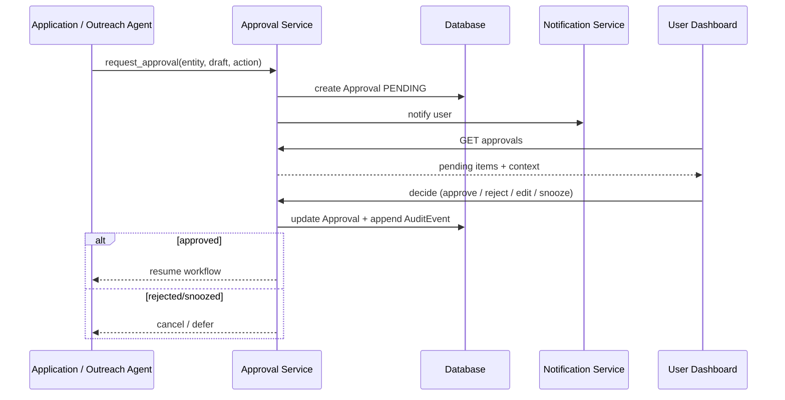

# Human Approval Workflow

## Goal

Ensure the user explicitly authorizes any external action before it is executed.

## Default Autonomy Level

**Level 2 — Prepare + Human Approval.**

## Flow

## Approval Context

Each approval request includes:

* Job title, company, location.
* Match score and reasons.
* Draft resume/cover letter/answers or message.
* Recommended action.
* Deadline (optional).

## Decisions

* **Approve** — continue workflow.
* **Reject** — mark entity rejected and stop.
* **Edit** — allow user to modify materials; create new approval request.
* **Snooze** — defer decision and remind later.

## Audit

Every decision writes to `AuditEvent` with actor, timestamp, and outcome.
