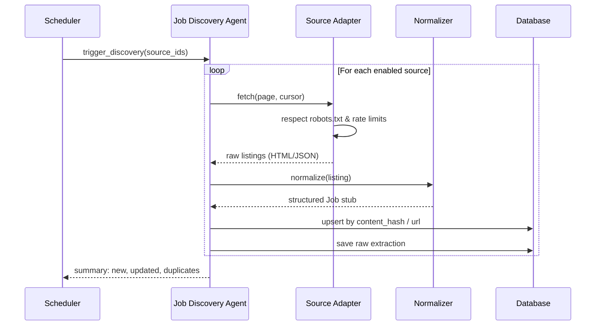

# Job Discovery Workflow

## Goal

Find legitimate job postings from configured sources, normalize them, and deduplicate records.

## Flow

## Inputs

* Source configuration (`JobSource`).
* Crawl state (last cursor, timestamp).

## Outputs

* `Job` records with status `DISCOVERED`.
* `RawJobExtraction` records for audit.

## Deduplication

1. Exact URL match.
2. Company + external_id match.
3. Content hash match (normalized title, location, description).

## Permitted Source: LinkedIn Job Alerts (via Gmail)

* LinkedIn Job Alert emails in Gmail are an **ingestion feed** using read-only Gmail
  OAuth (`gmail.readonly`). See [`ADR-010`](../adr/adr-010-linkedin-gmail-integration-boundaries.md).
* Alert emails are converted to canonical job URLs (`https://www.linkedin.com/jobs/view/<id>`);
  tracking/auth parameters are stripped and non-normalizable URLs are dropped.
* Email content is **untrusted input**; extracted fields are heuristic and may be sparse
  (e.g., locations often missing) — the Verification Agent remains authoritative.
* No LinkedIn browser automation, cookies, or credentials. The final LinkedIn
  application submission is performed manually by the user after approval.

## Failure Handling

* Source unreachable → retry twice, then disable source and alert.
* Rate limited → exponential backoff, reschedule.
* Parse failure → log to `AgentRun` and continue with next listing.
