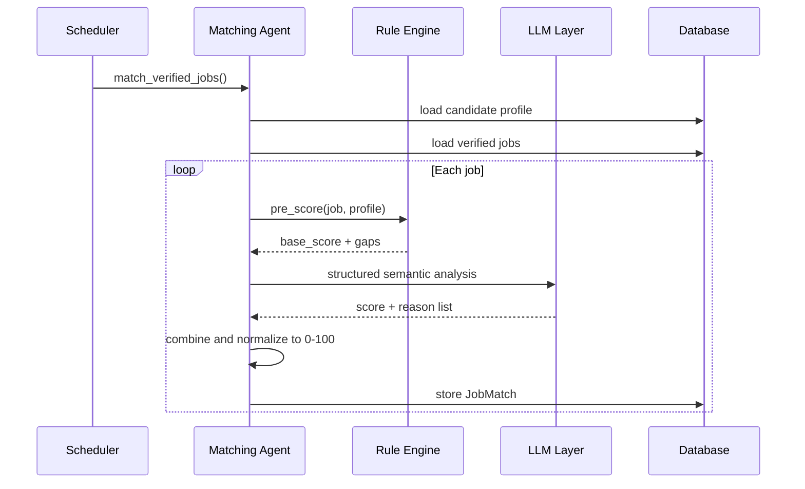

# Job Matching Workflow

## Goal

Calculate an explainable match score between a verified job and the candidate profile.

## Flow

## Match Dimensions

| Dimension | Weight (initial) | Example signals |
|-----------|-----------------|-----------------|
| Skills | 30% | Java, Spring Boot, Kubernetes, AWS |
| Experience | 20% | Years in relevant roles |
| Seniority / Leadership | 15% | Engineering management, team leadership |
| Domain | 15% | Telecom, OSS/BSS, CPQ/PIM |
| Location / Work mode | 10% | Remote, preferred cities |
| AI / Emerging tech | 10% | GenAI, AI-enabled SDLC |

Weights are user-configurable.

## Explainability

Each match includes a list of reasons:

* Strong Java/Spring Boot match.
* Strong engineering leadership match.
* Strong telecom domain match.
* Location compatible.
* AI experience relevant.

## Caching

Match results are cached by `(job_content_hash, profile_hash)` to avoid repeated LLM calls.

## Outputs

* `JobMatch` record.
* In-app notification if score ≥ configured threshold.
