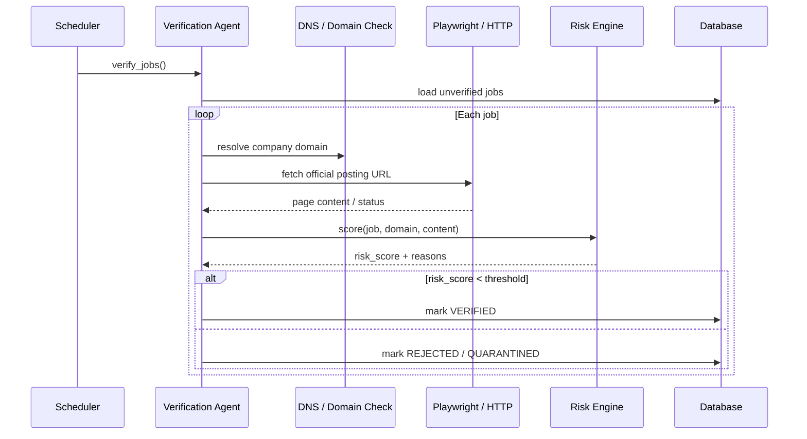

# Job Verification Workflow

## Goal

Confirm that a discovered job is posted by a legitimate company and is still open.

## Flow

## Verification Signals

* Domain resolves and uses HTTPS.
* Job URL returns 200 and contains expected title.
* Company name matches domain or official registry.
* No suspicious patterns (unrealistic salary, missing contact, poor grammar).

## Risk Score

Score is 0–100. Jobs with score ≥ 70 are not surfaced. Score components:

* Domain reputation (20)
* Official posting presence (30)
* Content quality (20)
* Company metadata completeness (15)
* Source trust level (15)

## Outputs

* `JobVerification` record.
* Updated `Job.status`.
* `AuditEvent` for rejections.
