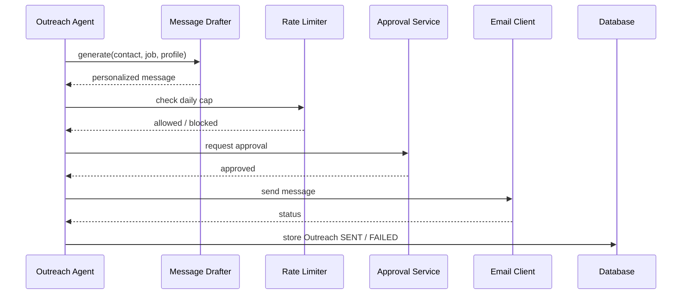

# Outreach Workflow

## Goal

Prepare personalized recruiter and networking messages and send them only after explicit approval.

## Flow

## Inputs

* Verified `RecruiterContact`.
* `Job` and `Candidate` profile.

## Outputs

* `Outreach` record, initially `DRAFT` then `APPROVAL_REQUIRED`.

## Rate Limiting

* Daily send cap per user (default low, e.g., 5–10).
* Minimum interval between sends.
* Per-source limits respected.

## Approval

Outreach defaults to human approval. Level 3 autonomy may send pre-approved templates only on verified contacts.
