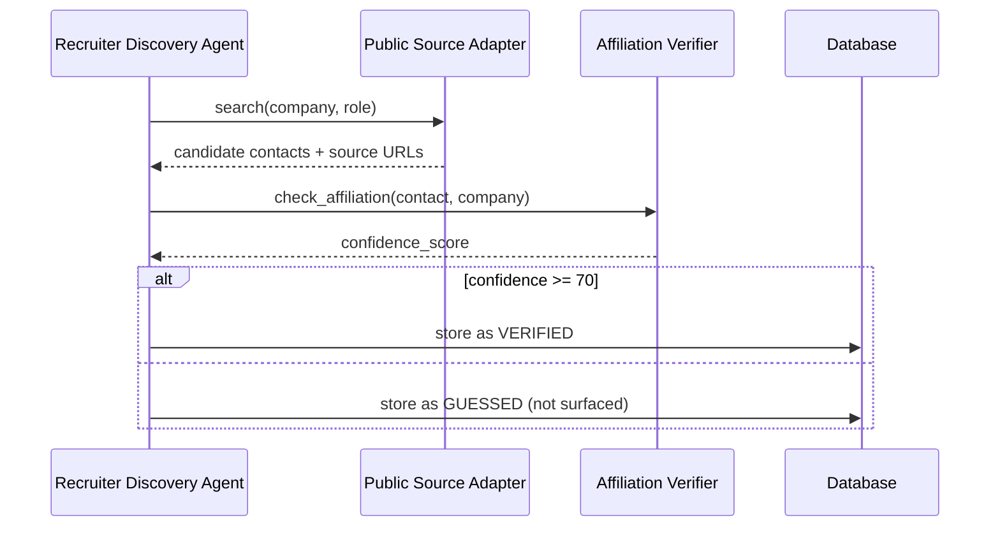

# Recruiter Discovery Workflow

## Goal

Identify legitimate, publicly available recruiting contacts for target companies without scraping private data.

## Flow

## Permitted Sources

* Official company career / team pages.
* Public recruiting directories.
* Professional networking pages where data is voluntarily public.

## Prohibited

* Scraping private contact databases.
* Guessing email addresses.
* Harvesting contacts from closed groups.

## LinkedIn Boundary

LinkedIn people search, employee/alumni discovery, and second-degree browsing are **not
automated** (ADR-010, GATE 2 — not available to this application). For networking, the
user manually identifies a relevant person on LinkedIn and supplies permitted/public
profile information; the agent only evaluates relevance and drafts outreach.

## Outputs

* `RecruiterContact` with `contact_type` and `confidence_score`.
* Only `VERIFIED` contacts are shown to the user.
